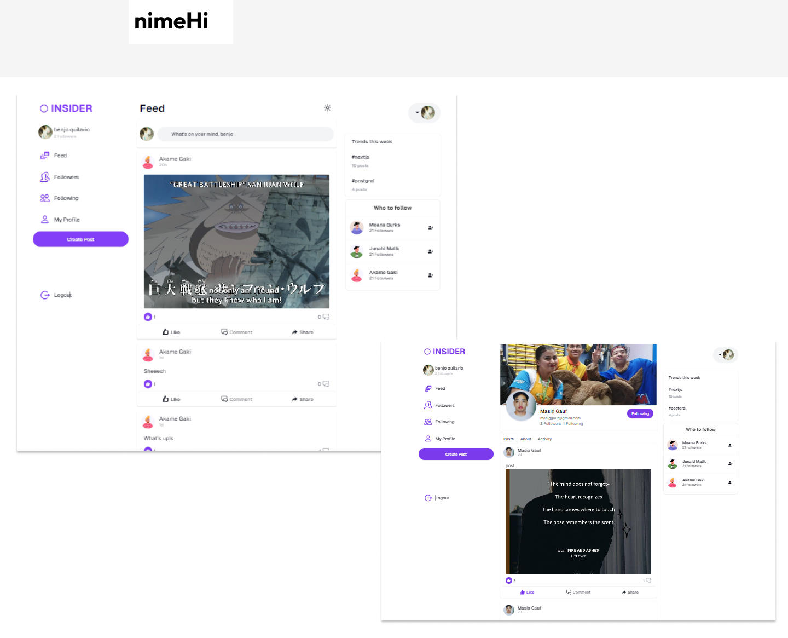
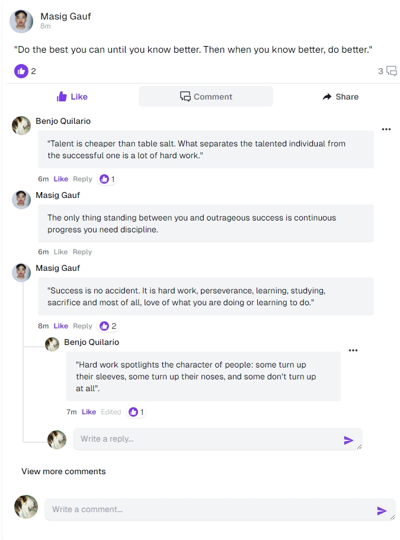

### Introducing Insider

A Fullstack **social media application** built with **_Next JS_**, **_React_**, **_Tanstack-query_**_, and \*\*\_tailwindCSS_** as a frontend and **_Prisma_**, and **_Posgres DB_\*\* as a backend.

<p align="center">
  <a href="https://github.com/benjoquilario/t3-insider">
      
    </a>
    <a href="https://www.gnu.org/licenses/agpl-3.0.en.html">
      
    </a>
     <a href="https://github.com/benjoquilario/t3-insider">
      
    </a>
</p>

</br>
  <hr />
<p align="center">
  <a href="https://nextjs.org">
    
  </a>
  <a href="https://tailwindcss.com/">
    
  </a>
  <a href="https://reactjs.org/">
    
  </a>
  <a href="https://www.prisma.io/">
    
  </a>
  <a href="https://react-hook-form.com/">
    
  </a>
  <a href="https://tailwindcss.com/">
    
  </a>
  <a href="https://www.framer.com/motion">
    
  </a>
</p>

## Screenshots

<a href="https://t3-insider.vercel.app/" target="blank">
  
</a>

### Comments

Share your thoughts in users posts



Try the App: [t3-insider](https://t3-insider.vercel.app/)

### Features

- Login and Register
- Post CRUD functionalities
- Comment CRUD Functionalities
- Like post
- like comment
- Reply to comments
- Profile Customization
- Suggestion to Follow
- Drag and Drop Image
- Multiple images post
- Followers/Following features
- Fully Responsive
- ...enough talk [see it yourself](https://t3-insider.vercel.app/)

### Coming Features

- Realtime Messaging features
- Realtime Notification features
- User can only see following users posts.
- Dark more
- Setting page
- <s>Update profile functionalities</s> ✅
  … and many more

## Installation Steps

1. Clone the repository

```bash
git clone https://github.com/benjoquilario/t3-insider.git
```

2. Change the working directory

```bash
cd t3-insider
```

3. Install dependencies

```bash
bun install
```

4. Create `.env` file in root and add your variables

```bash

AUTH_SECRET=
DATABASE_URL=
UPLOADTHING_SECRET=
UPLOADTHING_APP_ID=
AUTH_TRUST_HOST=http://localhost:3000

```

5. Sync your database

```bash
npx prisma migrade dev
```

6. Run the app

```bash
bun run dev
```

You are all set! Open [localhost:3000](http://localhost:3000/) to see the app.

> [!NOTE]
> This project is a work in progress, it still contains bugs and will constantly be updated to stay up-to-date with the latest framework changes.

## Contribution

Your ideas, translations, design changes, code cleaning, real heavy code changes, or any help are always welcome. The more is the contribution, the better it gets.

[Pull requests](https://github.com/benjoquilario/t3-insider/pulls) will be reviewed

## Author

### Benjo Quilario

- Twitter: [@iambenjo](https://twitter.com/iam_benjo)
- Github: [@benjoquilario](https://github.com/benjoquilario)
- Portfolio: [@benjoquilario](https://benjoquilario.site)

Please give this repository a ⭐️ if you liked this app. It seems like a little thing, but it helps a lot with the motivation.
